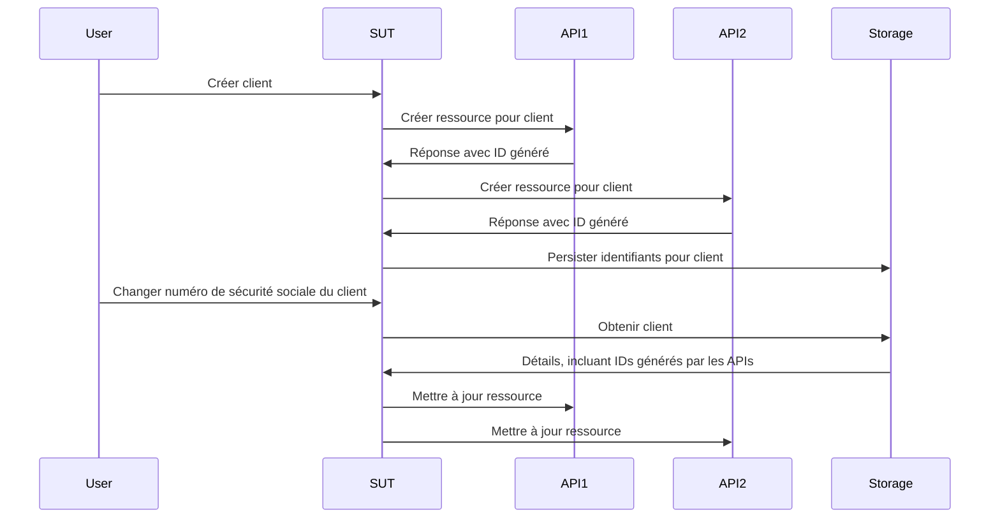

# Travailler sans mocks, stubs et spies

Ce chapitre plonge dans le monde des doublures de test et explore comment elles influencent le processus de test et de développement. Nous découvrirons les limites des mocks, stubs et spies traditionnels et présenterons une approche plus efficace et adaptable utilisant des fakes et des contrats.

## tl;dr

- Les mocks, spies et stubs vous encouragent à encoder des hypothèses sur le comportement de vos dépendances de manière ad hoc dans chaque test.
- Ces hypothèses ne sont généralement pas validées au-delà d'une vérification manuelle, ce qui menace l'utilité de votre suite de tests.
- Les fakes et les contrats nous donnent une méthode plus durable pour créer des doublures de test avec des hypothèses validées et une meilleure réutilisation que les alternatives.

C'est un chapitre plus long que d'habitude, donc pour vous rafraîchir les idées, vous devriez explorer d'abord un [exemple de dépôt](https://github.com/quii/go-fakes-and-contracts). En particulier, consultez le [test du planificateur](https://github.com/quii/go-fakes-and-contracts/blob/main/domain/planner/planner_test.go).

---

Dans [Mocking,](https://quii.gitbook.io/learn-go-with-tests/go-fundamentals/mocking), nous avons appris comment les mocks, stubs et spies sont des outils utiles pour contrôler et inspecter le comportement des unités de code en conjonction avec [l'Injection de Dépendance](https://quii.gitbook.io/learn-go-with-tests/go-fundamentals/dependency-injection).

Cependant, à mesure qu'un projet se développe, ces types de doublures de test *peuvent* devenir un fardeau de maintenance, et nous devrions plutôt nous tourner vers d'autres idées de conception pour maintenir notre système facile à raisonner et à tester.

Les **fakes** et les **contrats** permettent aux développeurs de tester leurs systèmes avec des scénarios plus réalistes, d'améliorer l'expérience de développement local avec des boucles de rétroaction plus rapides et plus précises, et de gérer la complexité des dépendances en évolution.

### Une introduction aux doublures de test

Il est facile de lever les yeux au ciel quand des gens comme moi sont pédants sur la nomenclature des doublures de test, mais les différents types de doublures de test nous aident à parler de ce sujet et des compromis que nous faisons avec clarté.

**Doublures de test** est le nom collectif pour les différentes façons dont vous pouvez construire des dépendances que vous pouvez contrôler pour un **sujet sous test (SUT)**, la chose que vous testez. Les doublures de test sont souvent une meilleure alternative que d'utiliser la véritable dépendance car elles peuvent éviter des problèmes comme :

- Avoir besoin d'Internet pour utiliser une API
- Éviter la latence et d'autres problèmes de performance
- Incapacité à exercer des cas qui ne sont pas des cas heureux
- Découplage de votre build de celui d'une autre équipe.
  - Vous ne voudriez pas empêcher les déploiements si un ingénieur d'une autre équipe expédiait accidentellement un bug

En Go, vous modéliserez généralement une dépendance avec une interface, puis implémenterez votre propre version pour contrôler le comportement dans un test. **Voici les types de doublures de test abordés dans ce billet**.

Étant donné cette interface d'une API de recettes hypothétique :

```go
type RecipeBook interface {
	GetRecipes() ([]Recipe, error)
	AddRecipes(...Recipe) error
}
```

Nous pouvons construire des doublures de test de différentes manières, selon la façon dont nous essayons de tester quelque chose qui utilise un `RecipeBook`.

**Les stubs** renvoient les mêmes données préfabriquées à chaque fois qu'ils sont appelés

```go
type StubRecipeStore struct {
	recipes []Recipe
	err     error
}

func (s *StubRecipeStore) GetRecipes() ([]Recipe, error) {
	return s.recipes, s.err
}

// AddRecipes omis pour concision
```

```go
// dans le test, nous pouvons configurer le stub pour toujours renvoyer des recettes spécifiques, ou une erreur
stubStore := &StubRecipeStore{
	recipes: someRecipes,
}
```

**Les spies** sont comme des stubs mais enregistrent également comment ils ont été appelés pour que le test puisse affirmer que le SUT appelle les dépendances de manières spécifiques.

```go
type SpyRecipeStore struct {
	AddCalls [][]Recipe
	err      error
}

func (s *SpyRecipeStore) AddRecipes(r ...Recipe) error {
	s.AddCalls = append(s.AddCalls, r)
	return s.err
}

// GetRecipes omis pour concision
```

```go
// dans le test
spyStore := &SpyRecipeStore{}
sut := NewThing(spyStore)
sut.DoStuff()

// maintenant nous pouvons vérifier que le store a reçu les bonnes recettes en inspectant spyStore.AddCalls
```

**Les mocks** sont comme un sur-ensemble des éléments ci-dessus, mais ils ne répondent qu'avec des données spécifiques à des invocations spécifiques. Si le SUT appelle les dépendances avec les mauvais arguments, ils vont généralement paniquer.

```go
// configurez le mock avec les appels attendus
mockStore := &MockRecipeStore{}
mockStore.WhenCalledWith(someRecipes).Return(someError)

// lorsque le sut utilise la dépendance, s'il ne l'appelle pas avec someRecipes, généralement les mocks vont paniquer
```

**Les fakes** sont comme une version authentique de la dépendance mais implémentée d'une manière plus adaptée à des tests rapides, fiables et au développement local. Souvent, votre système aura une certaine abstraction autour de la persistance, qui sera implémentée avec une base de données, mais dans vos tests, vous pourriez utiliser un fake en mémoire à la place.

```go
type FakeRecipeStore struct {
	recipes []Recipe
}

func (f *FakeRecipeStore) GetRecipes() ([]Recipe, error) {
	return f.recipes, nil
}

func (f *FakeRecipeStore) AddRecipes(r ...Recipe) error {
	f.recipes = append(f.recipes, r...)
	return nil
}
```

Les fakes sont utiles parce que :

- Leur caractère stateful est utile pour les tests impliquant plusieurs sujets et invocations, comme un test d'intégration. Gérer l'état avec les autres types de doublures de test est généralement déconseillé.
- S'ils ont une API sensée, ils offrent une manière plus naturelle d'affirmer l'état. Plutôt que d'espionner des appels spécifiques à une dépendance, vous pouvez interroger son état final pour voir si l'effet réel que vous voulez s'est produit.
- Vous pouvez les utiliser pour exécuter votre application localement sans démarrer ou dépendre de vraies dépendances. Cela améliorera généralement l'expérience développeur (DX) car les fakes seront plus rapides et plus fiables que leurs homologues réels.

Les spies, mocks et stubs peuvent généralement être autogénérés à partir d'une interface en utilisant un outil ou en utilisant la réflexion. Cependant, comme les fakes encodent le comportement de la dépendance que vous essayez de doubler, vous devrez écrire au moins la majeure partie de l'implémentation vous-même.

## Le problème avec les stubs et les mocks

Dans [Anti-patterns,](https://quii.gitbook.io/learn-go-with-tests/meta/anti-patterns), il y a des détails sur la façon dont l'utilisation des doublures de test doit être faite avec précaution. Il est facile de créer une suite de tests désordonnée si vous ne les utilisez pas avec goût. À mesure qu'un projet se développe, d'autres problèmes peuvent s'insinuer.

Lorsque vous encodez le comportement dans des doublures de test, vous ajoutez vos hypothèses sur le fonctionnement de la véritable dépendance dans le test. S'il y a une divergence entre le comportement du double et de la véritable dépendance, ou si cela se produit au fil du temps (par exemple, la véritable dépendance change, ce qui *doit* être attendu), **vous pourriez avoir des tests réussis mais un logiciel défaillant**.

Les stubs, spies et mocks, en particulier, présentent d'autres défis, principalement à mesure qu'un projet se développe. Pour illustrer cela, je vais décrire un projet sur lequel j'ai travaillé.

### Étude de cas d'exemple

*Certains détails sont modifiés par rapport à ce qui s'est réellement passé, et cela a été grandement simplifié pour des raisons de concision. **Toute ressemblance avec des personnes réelles, vivantes ou décédées, est purement fortuite.***

J'ai travaillé sur un système qui devait appeler **six** APIs différentes, écrites et maintenues par d'autres équipes à travers le monde. Elles étaient _REST-ish_, et le travail de notre système était de créer et gérer des ressources dans chacune d'elles. Lorsque nous appelions correctement toutes les APIs pour chaque système, la _magie_ (valeur métier) se produisait.

Notre application était structurée selon une architecture hexagonale / ports & adaptateurs. Notre code de domaine était découplé du désordre du monde extérieur auquel nous devions faire face. Nos "adaptateurs" étaient, en effet, des clients Go qui encapsulaient l'appel aux diverses APIs.


#### Problèmes

Naturellement, nous avons adopté une approche pilotée par les tests pour construire le système. Nous avons utilisé des stubs pour simuler les réponses des APIs en aval et avions une poignée de tests d'acceptation pour nous rassurer que tout devrait fonctionner.

Les APIs que nous devions appeler étaient pour la plupart :

- mal documentées
- gérées par des équipes qui avaient beaucoup d'autres priorités et pressions conflictuelles, il n'était donc pas facile d'obtenir du temps avec elles
- souvent manquantes de couverture de test, donc elles se cassaient de manières amusantes et inattendues, régressaient, etc.
- étaient encore en cours de construction et d'évolution

Cela a conduit à **beaucoup de tests instables** et beaucoup de maux de tête. Une _partie significative_ de notre temps était consacrée à envoyer des messages à de nombreuses personnes occupées sur Slack pour obtenir des réponses à :

- Pourquoi l'API a-t-elle commencé à faire `x` ?
- Pourquoi l'API fait-elle quelque chose de différent quand nous faisons `y` ?

Le développement logiciel est rarement aussi simple qu'on le souhaiterait ; c'est un exercice d'apprentissage. Nous devions continuellement apprendre comment fonctionnaient les APIs externes. À mesure que nous apprenions et nous adaptions, nous devions mettre à jour et ajouter à notre suite de tests, en particulier, **changer nos stubs pour correspondre au comportement réel des APIs.**

Le problème est que cela prenait beaucoup de notre temps et conduisait à plus d'erreurs. Quand votre connaissance d'une dépendance change, vous devez trouver le **bon** test à mettre à jour pour changer le comportement du stub, et il y a un risque réel de négliger de le mettre à jour dans d'autres stubs représentant la même dépendance.

#### Stratégie de test

En plus de cela, comme le système grandissait et les exigences changeaient, nous avons réalisé que notre stratégie de test n'était pas adaptée. Nous avions une poignée de tests d'acceptation qui nous donnaient confiance que le système dans son ensemble fonctionnait et ensuite un grand nombre de tests unitaires pour les divers packages que nous avions écrits.

<u>Nous avions besoin de quelque chose entre les deux</u> ; nous voulions souvent changer le comportement de diverses parties du système ensemble **mais ne pas avoir à démarrer le *système entier* pour un test d'acceptation**. Les tests unitaires seuls ne nous donnaient pas confiance que les divers composants fonctionnaient dans leur ensemble ; ils ne pouvaient pas raconter (et vérifier) l'histoire de ce que nous essayions d'accomplir. **Nous voulions des tests d'intégration**.

#### Tests d'intégration

Les tests d'intégration prouvent que deux ou plusieurs "unités" fonctionnent correctement lorsqu'elles sont combinées (ou intégrées !). Ces unités peuvent être le code que vous écrivez ou le code que vous écrivez intégré avec le code de quelqu'un d'autre, comme une base de données.

À mesure qu'un projet se développe, vous voulez écrire plus de tests d'intégration pour prouver que de grandes parties de votre système "tiennent ensemble" - ou s'intègrent !

Vous pourriez être tenté d'écrire plus de tests d'acceptation en boîte noire, mais ils deviennent rapidement coûteux en termes de temps de construction et de coûts de maintenance. Il peut être trop coûteux de démarrer un système entier lorsque vous voulez seulement vérifier qu'un *sous-ensemble* du système (mais pas seulement une seule unité) se comporte comme il le devrait. Écrire des tests coûteux en boîte noire pour chaque fonctionnalité que vous réalisez n'est pas durable pour les systèmes plus grands.

#### Entrez : les Fakes

Le problème était que la façon dont nos unités étaient testées reposait sur des stubs, qui sont, pour la plupart, *sans état*. Nous voulions écrire des tests couvrant plusieurs appels d'API *avec état*, où nous pourrions créer une ressource au début puis la modifier plus tard.

Voici une version réduite d'un test que nous voulons faire.

Le SUT est une "couche de service" traitant des demandes de "cas d'utilisation". Nous voulons prouver que si un client est créé, lorsque ses détails changent, nous mettons à jour avec succès les ressources que nous avons créées dans les APIs respectives.

Voici les exigences données à l'équipe sous forme d'histoire utilisateur.

> ***Étant donné*** qu'un utilisateur est enregistré avec les API 1, 2 et 3
>
> ***Quand*** le numéro de sécurité sociale du client est modifié
>
> ***Alors**,* le changement est propagé dans les API 1, 2 et 3



Les tests qui traversent plusieurs unités sont généralement incompatibles avec les stubs **parce qu'ils ne sont pas adaptés au maintien de l'état**. Nous _pourrions_ écrire un test d'acceptation en boîte noire, mais les coûts de ces tests spiraliseraient rapidement hors de contrôle.

De plus, il est compliqué de tester les cas limites avec un test en boîte noire car vous ne pouvez pas contrôler les dépendances. Par exemple, nous voulions prouver qu'un mécanisme de rollback serait déclenché si un appel API échouait.

Nous avions besoin d'utiliser des **fakes**. En modélisant nos dépendances comme des APIs avec état en mémoire, nous avons pu écrire des tests d'intégration avec une portée beaucoup plus large, **pour nous permettre de tester que les cas d'utilisation réels fonctionnaient**, encore une fois *sans* avoir à démarrer tout le système, et à la place avoir presque la même vitesse que les tests unitaires.


En utilisant des fakes, **nous pouvons faire des assertions basées sur les états finaux des systèmes respectifs plutôt que de s'appuyer sur un espionnage compliqué**. Nous demanderions à chaque fake quels enregistrements il détenait pour le client et affirmerions qu'ils étaient mis à jour. Cela semble plus naturel ; si nous vérifiions manuellement notre système, nous interrogerions ces APIs pour vérifier leur état, pas inspecter nos journaux de requêtes pour voir si nous avons envoyé des charges utiles JSON particulières.

```go
// prenez nos briques lego et assemblez le système pour le test
fakeAPI1 := fakes.NewAPI1()
fakeAPI2 := fakes.NewAPI2() // etc..
customerService := customer.NewService(fakeAPI1, fakeAPI2, etc...)

// créer un nouveau client
newCustomerRequest := NewCustomerReq{
	// ...
}
createdCustomer, err := customerService.New(newCustomerRequest)
assert.NoErr(t, err)

// nous pouvons vérifier que tous les détails sont comme attendus dans les différents fakes d'une manière naturelle, comme si c'étaient des APIs normales
fakeAPI1Customer := fakeAPI1.Get(createdCustomer.FakeAPI1Details.ID)
assert.Equal(t, fakeAPI1Customer.SocialSecurityNumber, newCustomerRequest.SocialSecurityNumber)

// répétez pour les autres apis qui nous intéressent

// mettre à jour le client
updatedCustomerRequest := NewUpdateReq{SocialSecurityNumber: "123", InternalID: createdCustomer.InternalID}
assert.NoErr(t, customerService.Update(updatedCustomerRequest))

// encore une fois, nous pouvons vérifier les différents fakes pour voir si l'état finit comme nous le voulons
updatedFakeAPICustomer := fakeAPI1.Get(createdCustomer.FakeAPI1Details.ID)
assert.Equal(t, updatedFakeAPICustomer.SocialSecurityNumber, updatedCustomerRequest.SocialSecurityNumber)
```

C'est plus simple à écrire et plus facile à lire que de vérifier divers arguments d'appel de fonction faits via des spies.

Cette approche nous permet d'avoir des tests qui traversent de larges parties de notre système, nous permettant d'écrire des tests plus **significatifs** sur les cas d'utilisation dont nous discuterions lors des stand-ups tout en exécutant encore exceptionnellement rapidement.

#### Les fakes apportent plus d'avantages de l'encapsulation

Dans l'exemple ci-dessus, les tests ne se préoccupaient pas de la façon dont les dépendances se comportaient au-delà de la vérification de leur état final. Nous avons créé les versions fake des dépendances et les avons injectées dans la partie du système que nous testons.

Avec les mocks/stubs, nous devrions configurer chaque dépendance pour gérer certains scénarios, renvoyer certaines données, etc. Cela introduit le comportement et les détails d'implémentation dans vos tests, affaiblissant les avantages de l'encapsulation.

Nous modélisons les dépendances derrière des interfaces pour que, en tant que clients, _nous n'ayons pas à nous soucier de leur fonctionnement_, mais avec une approche "mockiste", _nous devons nous en soucier **dans chaque test**_.

#### Les coûts de maintenance des fakes

Les fakes sont plus coûteux que les autres doublures de test, au moins en termes de code écrit ; ils doivent porter l'état et simuler le comportement de ce qu'ils simulent. Toute divergence de comportement entre votre fake et la chose réelle **comporte un risque** que vos tests ne soient pas alignés sur la réalité. Cela conduit au scénario où vous avez des tests réussis mais un logiciel cassé.

Chaque fois que vous vous intégrez à un autre système, que ce soit l'API d'une autre équipe ou une base de données, vous ferez des hypothèses basées sur son comportement. Celles-ci pourraient être capturées à partir de documentations d'API, de conversations en personne, d'e-mails, de fils Slack, etc.

Ne serait-il pas utile si nous pouvions **codifier nos hypothèses** pour les exécuter contre à la fois notre fake *et* le système réel pour voir si notre connaissance est correcte d'une manière répétable et documentée ?

Les **contrats** sont le moyen pour y parvenir. Ils nous ont aidés à gérer les hypothèses que nous avons faites sur les systèmes de l'autre équipe et à les rendre explicites. Bien plus explicites et utiles que les échanges d'e-mails ou les fils Slack sans fin !


En ayant un contrat, nous pouvons supposer que nous pouvons utiliser un fake et une dépendance réelle de manière interchangeable. C'est non seulement utile pour construire des tests, mais aussi pour le développement local.

Voici un exemple de contrat pour l'une des APIs dont le système dépend

```go
type API1Customer struct {
	Name string
	ID   string
}

type API1 interface {
	CreateCustomer(ctx context.Context, name string) (API1Customer, error)
	GetCustomer(ctx context.Context, id string) (API1Customer, error)
	UpdateCustomer(ctx context.Context, id string, name string) error
}

type API1Contract struct {
	NewAPI1 func() API1
}

func (c API1Contract) Test(t *testing.T) {
	t.Run("can create, get and update a customer", func(t *testing.T) {
		var (
			ctx  = context.Background()
			sut  = c.NewAPI1()
			name = "Bob"
		)
		customer, err := sut.CreateCustomer(ctx, name)
		expect.NoErr(t, err)

		got, err := sut.GetCustomer(ctx, customer.ID)
		expect.NoErr(t, err)
		expect.Equal(t, customer, got)

		newName := "Robert"
		expect.NoErr(t, sut.UpdateCustomer(ctx, customer.ID, newName))

		got, err = sut.GetCustomer(ctx, customer.ID)
		expect.NoErr(t, err)
		expect.Equal(t, newName, got.Name)
	})

	// exemple de comportements étranges que nous n'attendions pas
	t.Run("the system will not allow you to add 'Dave' as a customer", func(t *testing.T) {
		var (
			ctx  = context.Background()
			sut  = c.NewAPI1()
			name = "Dave"
		)

		_, err := sut.CreateCustomer(ctx, name)
		expect.Err(t, ErrDaveIsForbidden)
	})
}
```

Comme discuté dans [Scaling Acceptance Tests](https://quii.gitbook.io/learn-go-with-tests/testing-fundamentals/scaling-acceptance-tests), en testant contre une interface plutôt qu'un type concret, le test devient :

- Découplé des détails d'implémentation
- Peut être réutilisé dans différents contextes.

Ce qui sont les exigences pour un contrat. Il nous permet de vérifier et développer notre fake _et_ de le tester contre l'implémentation réelle.

Pour créer notre fake en mémoire, nous pouvons utiliser le contrat dans un test.

```go
func TestInMemoryAPI1(t *testing.T) {
	API1Contract{NewAPI1: func() API1 {
		return inmemory.NewAPI1()
	}}.Test(t)
}
```

Et voici le code du fake

```go
func NewAPI1() *API1 {
	return &API1{customers: make(map[string]planner.API1Customer)}
}

type API1 struct {
	i         int
	customers map[string]planner.API1Customer
}

func (a *API1) CreateCustomer(ctx context.Context, name string) (planner.API1Customer, error) {
	if name == "Dave" {
		return planner.API1Customer{}, ErrDaveIsForbidden
	}

	newCustomer := planner.API1Customer{
		Name: name,
		ID:   strconv.Itoa(a.i),
	}
	a.customers[newCustomer.ID] = newCustomer
	a.i++
	return newCustomer, nil
}

func (a *API1) GetCustomer(ctx context.Context, id string) (planner.API1Customer, error) {
	return a.customers[id], nil
}

func (a *API1) UpdateCustomer(ctx context.Context, id string, name string) error {
	customer := a.customers[id]
	customer.Name = name
	a.customers[id] = customer
	return nil
}
```

### Évolution du logiciel

La plupart des logiciels ne sont pas construits et "terminés" pour toujours, en une seule version.

C'est un exercice d'apprentissage incrémental, s'adaptant aux demandes des clients et à d'autres changements externes. Dans l'exemple, les APIs que nous appelions évoluaient et changeaient également ; de plus, à mesure que nous développions _notre_ logiciel, nous en apprenions davantage sur le système que nous _devions_ réellement créer. Les hypothèses que nous avions faites dans nos contrats se sont avérées fausses ou _sont devenues_ fausses.

Heureusement, une fois la configuration des contrats réalisée, nous avions une façon simple de gérer le changement. Une fois que nous apprenions quelque chose de nouveau, à la suite d'un bug corrigé ou d'un collègue nous informant que l'API changeait, nous :

1. Écrivions un test pour exercer le nouveau scénario. Une partie de cela impliquera de changer le contrat pour vous **conduire** à simuler le comportement dans le fake
2. L'exécution du test devrait échouer, mais avant toute autre chose, exécuter le contrat contre la véritable dépendance pour s'assurer que le changement au contrat est valide.
3. Mettre à jour le fake pour qu'il soit conforme au contrat.
4. Faire passer le test.
5. Refactoriser.
6. Exécuter tous les tests et livrer.

L'exécution de la _suite complète_ de tests avant de valider _peut_ entraîner l'échec d'autres tests en raison du fake ayant un comportement différent. C'est une **bonne chose** ! Vous pouvez maintenant corriger toutes les autres zones du système dépendant du système modifié ; confiant qu'elles géreront également ce scénario en production. Sans cette approche, vous devriez *vous souvenir* de trouver tous les tests pertinents et de mettre à jour les stubs. Sujet aux erreurs, laborieux et ennuyeux.

### Expérience développeur supérieure

Avoir la suite de fakes avec les contrats correspondants semblait être un superpouvoir. Nous pouvions enfin dompter la complexité des APIs avec lesquelles nous devions traiter.

Écrire des tests pour divers scénarios devenait beaucoup plus simple. Nous n'avions plus à assembler une série de stubs et de spies pour chaque test ; nous pouvions prendre notre ensemble d'unités ou de modules (les fakes, nos propres "services") et les assembler très facilement pour exercer les divers scénarios bizarres et merveilleux dont nous avions besoin.

Chaque test avec un stub, un spy ou un mock doit _se préoccuper_ de la façon dont le système externe se comporte, en raison de la configuration ad hoc. En revanche, les fakes peuvent être traités comme n'importe quelle autre unité de code bien encapsulée, où les détails sont cachés de vous, et vous pouvez simplement les utiliser.

Nous pouvions exécuter une version très réaliste du système localement, et comme tout était en mémoire, il démarrait et s'exécutait extrêmement rapidement. Cela signifiait que nos temps de test étaient extrêmement rapides, ce qui semblait très impressionnant, étant donné à quel point la suite était complète.

Si nos tests d'acceptation échouaient dans notre environnement de préproduction, notre première étape était d'exécuter nos contrats contre les APIs dont nous dépendions. Nous identifiions souvent des problèmes **avant même les développeurs des autres systèmes**.

### Hors du chemin heureux avec les décorateurs

Pour les scénarios d'erreur, les stubs sont plus pratiques car vous avez un accès direct à *comment* ils se comportent dans le test, alors que les fakes ont tendance à être assez boîte noire. C'est un choix de conception délibéré, car nous voulons que les utilisateurs (par exemple, les tests) ne se préoccupent pas de leur fonctionnement ; ils devraient leur faire confiance pour faire la bonne chose grâce au soutien du contrat.

Comment faisons-nous échouer les fakes, pour exercer des préoccupations hors du chemin heureux ?

Il existe de nombreux scénarios où, en tant que développeur, vous devez modifier le comportement d'un code sans changer sa source. Le **modèle décorateur** est souvent un moyen de prendre une unité de code et d'ajouter des choses comme la journalisation, la télémétrie, les nouvelles tentatives et plus encore. Nous pouvons l'utiliser pour envelopper nos fakes afin de remplacer les comportements lorsque c'est nécessaire.

Revenant à l'exemple `API1`, nous pouvons créer un type qui implémente l'interface nécessaire et enveloppe le fake.

```go
```go
type API1Decorator struct {
	delegate           API1
	CreateCustomerFunc func(ctx context.Context, name string) (API1Customer, error)
	GetCustomerFunc    func(ctx context.Context, id string) (API1Customer, error)
	UpdateCustomerFunc func(ctx context.Context, id string, name string) error
}

// assert API1Decorator implements API1
var _ API1 = &API1Decorator{}

func NewAPI1Decorator(delegate API1) *API1Decorator {
	return &API1Decorator{delegate: delegate}
}

func (a *API1Decorator) CreateCustomer(ctx context.Context, name string) (API1Customer, error) {
	if a.CreateCustomerFunc != nil {
		return a.CreateCustomerFunc(ctx, name)
	}
	return a.delegate.CreateCustomer(ctx, name)
}

func (a *API1Decorator) GetCustomer(ctx context.Context, id string) (API1Customer, error) {
	if a.GetCustomerFunc != nil {
		return a.GetCustomerFunc(ctx, id)
	}
	return a.delegate.GetCustomer(ctx, id)
}

func (a *API1Decorator) UpdateCustomer(ctx context.Context, id string, name string) error {
	if a.UpdateCustomerFunc != nil {
		return a.UpdateCustomerFunc(ctx, id, name)
	}
	return a.delegate.UpdateCustomer(ctx, id, name)
}
```

Dans nos tests, nous pouvons alors utiliser le champ `XXXFunc` pour modifier le comportement de la doublure de test, tout comme vous le feriez avec des stubs, des spies ou des mocks.

```go
failingAPI1 = NewAPI1Decorator(inmemory.NewAPI1())
failingAPI1.UpdateCustomerFunc = func(ctx context.Context, id string, name string) error {
	return errors.New("failed to update customer")
}
```

Cependant, cela _est_ maladroit et vous demande d'exercer un certain jugement. Avec cette approche, vous perdez les garanties de votre contrat car vous introduisez un comportement ad hoc à votre fake dans les tests.

Il serait préférable d'examiner votre contexte, vous pourriez conclure qu'il serait plus simple de tester des chemins non heureux spécifiques au niveau du test unitaire en utilisant un stub.

### Est-ce que ce code supplémentaire est du gaspillage ?

C'est un vœu pieux de croire que nous ne devrions jamais écrire que du code qui sert directement les clients et s'attendre à un système sur lequel nous pouvons construire efficacement. Les gens ont une opinion très déformée de ce qu'est le gaspillage (voir mon article : [Le fantôme de Henry Ford ruine votre équipe de développement](https://quii.dev/The_ghost_of_Henry_Ford_is_ruining_your_development_team)).

Les tests automatisés ne profitent pas directement aux clients, mais nous les écrivons pour nous rendre plus efficaces dans notre travail (vous n'écrivez pas de tests pour atteindre des scores de couverture, n'est-ce pas ?).

Les ingénieurs doivent facilement simuler des scénarios (de manière répétable, et non ad hoc) pour déboguer, tester et résoudre des problèmes. **Les fakes en mémoire et une bonne conception modulaire nous permettent d'isoler les acteurs pertinents pour un scénario afin d'écrire des tests rapides et appropriés à très faible coût**. Cette flexibilité permet aux développeurs d'itérer sur un système de manière beaucoup plus gérable qu'un enchevêtrement désordonné, testé via des tests en boîte noire coûteux à écrire et à exécuter ou, pire encore, des tests manuels sur un environnement partagé.

C'est un exemple de [simple vs. facile](https://www.youtube.com/watch?v=SxdOUGdseq4). Bien sûr, les fakes et les contrats entraîneront plus de code écrit que les stubs et les spies à court terme, mais le résultat est un système plus simple et moins coûteux à maintenir à long terme. La mise à jour des spies, des stubs et des mocks au cas par cas est laborieuse et sujette aux erreurs, car vous n'aurez pas de contrats correspondants pour vérifier que vos doublures de test se comportent correctement.

Cette approche représente un coût initial _légèrement_ plus élevé, mais avec des coûts bien moindres une fois que les contrats et les fakes sont configurés. Les fakes sont plus réutilisables et plus fiables que les doublures de test ad hoc comme les stubs.

Cela semble *très* libérateur et vous donne **confiance** lorsque vous utilisez un fake existant et éprouvé plutôt que de configurer un stub lors de l'écriture d'un nouveau test.

### Comment cela s'intègre-t-il au TDD ?

Je ne recommanderais pas de _commencer_ par un contrat ; c'est une conception ascendante, pour laquelle, en général, je trouve que je dois être plus intelligent, et il y a un danger que je réfléchisse trop à des exigences hypothétiques.

Cette technique est compatible avec "l'approche pilotée par les tests d'acceptation" comme discuté dans les chapitres précédents, [Le Pourquoi du TDD](https://quii.dev/The_Why_of_TDD) et dans [GOOS](http://www.growing-object-oriented-software.com)

- Écrivez un [test d'acceptation](https://quii.gitbook.io/learn-go-with-tests/testing-fundamentals/scaling-acceptance-tests) qui échoue.
- Produisez suffisamment de code pour le faire passer, ce qui aboutira généralement à une "couche de service" qui dépendra d'une API, d'une base de données ou autre. Habituellement, vous aurez du code de logique métier découplé des préoccupations externes (telles que la persistance, l'appel à une base de données, etc.) via une interface.
- Implémentez l'interface avec un fake en mémoire au début pour faire passer tous les tests localement et valider la conception initiale.
- Pour pousser en production, vous ne pouvez pas utiliser de la mémoire ! Encodez les hypothèses que vous avez faites contre le fake dans un contrat.
- Utilisez le contrat pour créer la dépendance réelle, comme une version MySQL d'un store.
- Livrez.

## Où est le chapitre sur les tests de bases de données ?

C'est une demande courante que j'ai reportée pendant plus de cinq ans. La raison est que ce chapitre sera toujours ma réponse.

<u>Ne moquez pas le pilote de base de données et n'espionnez pas les appels</u>. Ces tests sont difficiles à écrire et apportent potentiellement très peu de valeur. Vous ne devriez pas affirmer si une déclaration `SQL` particulière a été envoyée à la base de données, c'est un détail d'implémentation ; **vos tests ne devraient se soucier que du comportement**. Prouver qu'une déclaration SQL spécifique a été compilée _ne prouve pas_ que votre code _se comporte_ comme vous en avez besoin.

Les **contrats** vous obligent à découpler vos tests des détails d'implémentation et à vous concentrer sur le comportement.

Suivez l'approche TDD décrite ci-dessus pour répondre à vos besoins de persistance.

[Le dépôt d'exemple](https://github.com/quii/go-fakes-and-contracts) contient des exemples de contrats, et comment ils sont utilisés pour tester des implémentations en mémoire et SQLite de certains besoins de persistance.

```go
package inmemory_test

import (
	"github.com/quii/go-fakes-and-contracts/adapters/driven/persistence/inmemory"
	"github.com/quii/go-fakes-and-contracts/domain/planner"
	"testing"
)

func TestInMemoryPantry(t *testing.T) {
	planner.PantryContract{
		NewPantry: func() planner.Pantry {
			return inmemory.NewPantry()
		},
	}.Test(t)
}
```

```go
package sqlite_test

import (
	"github.com/quii/go-fakes-and-contracts/adapters/driven/persistence/sqlite"
	"github.com/quii/go-fakes-and-contracts/domain/planner"
	"testing"
)

func TestSQLitePantry(t *testing.T) {
	client := sqlite.NewSQLiteClient()
	t.Cleanup(func() {
		if err := client.Close(); err != nil {
			t.Error(err)
		}
	})

	planner.PantryContract{
		NewPantry: func() planner.Pantry {
			return sqlite.NewPantry(client)
		},
	}.Test(t)
}
```

Bien que Docker et al. _facilitent_ l'exécution locale des bases de données, ils peuvent toujours entraîner une surcharge de performances significative. Les fakes avec contrats vous permettent de restreindre la nécessité d'utiliser la dépendance "plus lourde" uniquement lorsque vous validez le contrat, et non nécessaire pour d'autres types de tests.

L'utilisation de fakes en mémoire pour les tests d'acceptation et d'intégration pour *le reste* du système fournit une expérience de développeur beaucoup plus rapide et plus simple.

## Conclusion

Il est courant que les projets logiciels soient organisés avec diverses équipes construisant des systèmes simultanément pour essayer d'atteindre un objectif commun.

Cette méthode de travail nécessite un haut degré de collaboration et de communication. Beaucoup pensent qu'avec une approche "API first", nous pouvons définir certains contrats d'API (souvent sur une page wiki !) puis travailler indépendamment pendant six mois et tout assembler. Cela fonctionne rarement bien en pratique car lorsque nous commençons à écrire du code, nous comprenons mieux le domaine et le problème, ce qui remet en question nos hypothèses. Nous devons réagir à ces changements dans les connaissances, qui nécessitent souvent des changements inter-équipes.

Donc, si vous êtes dans cette situation, vous devez structurer et tester votre système de manière optimale pour faire face à des changements imprévisibles, tant à l'intérieur qu'à l'extérieur du système sur lequel vous travaillez.

> "L'une des caractéristiques déterminantes des équipes performantes dans le développement logiciel est leur capacité à progresser et à changer d'avis, sans demander la permission à une personne ou un groupe en dehors de leur petite équipe."
>
> Modern Software Engineering
> David Farley

Ne vous fiez pas aux réunions hebdomadaires ou aux fils Slack pour développer les changements. **Codifiez vos hypothèses dans des contrats**. Exécutez ces contrats contre les systèmes dans vos pipelines de construction afin d'obtenir un retour rapide si de nouvelles informations apparaissent. Ces contrats, conjointement avec les **fakes,** signifient que vous pouvez travailler indépendamment et gérer les changements externes de manière durable.

### Votre système comme une collection de modules

En me référant au livre de Farley, je décris l'idée d'**incrémentalisme**. Construire un logiciel est un *exercice d'apprentissage constant*. Comprendre les exigences que nous devons résoudre pour un système donné afin de livrer de la valeur dès le départ est irréaliste. Nous devons donc optimiser nos systèmes et nos méthodes de travail pour **recueillir des retours rapidement et expérimenter**.

Vous avez besoin d'un **système modulaire** pour tirer parti des idées discutées dans ce chapitre. Si vous avez un code modulaire avec des fakes fiables, cela vous permet d'expérimenter avec votre système via des tests automatisés à faible coût.

Nous avons trouvé extrêmement facile de traduire des scénarios étranges, hypothétiques (mais possibles) en tests autonomes pour nous aider à comprendre le problème et à produire un logiciel plus robuste en composant nos modules ensemble et en essayant différentes données dans différents ordres, avec certaines APIs échouant, etc.

Des modules bien définis et bien testés vous permettent d'incrémenter votre système sans changer et comprendre _tout_ à la fois.

### Mais je travaille sur quelque chose de petit avec des APIs stables

Même avec des APIs stables, vous ne voulez pas que votre expérience développeur, vos builds, etc. soient étroitement couplés au code d'autres personnes. Lorsque vous maîtrisez cette approche, vous obtenez un ensemble composable de modules à assembler pour votre système en production, à exécuter localement et à écrire différents types de tests avec des doublures en lesquelles vous avez confiance.

Cela vous permet d'isoler les parties de votre système qui vous préoccupent et d'écrire des tests significatifs sur le problème réel que vous essayez de résoudre.

### Faites de vos dépendances des citoyens de première classe

Bien sûr, les stubs et les spies ont leur place. Simuler différents comportements de vos dépendances de manière ad hoc dans les tests aura toujours son utilité, mais attention à ne pas laisser les coûts devenir incontrôlables.

Tant de fois dans ma carrière, j'ai vu des logiciels soigneusement écrits par des développeurs talentueux s'effondrer en raison de problèmes d'intégration. L'intégration est difficile pour les ingénieurs _parce qu'il_ est difficile de reproduire les comportements exacts d'un système écrit par d'autres ingénieurs, qui le modifient également simultanément.

Certaines équipes comptent sur le fait que tout le monde déploie dans un environnement partagé et y effectue des tests. Le problème est que cela ne vous donne pas de retour **isolé**, et le **retour est lent**. Vous ne pourrez toujours pas construire différentes expériences sur la façon dont votre système fonctionne avec d'autres dépendances, du moins pas efficacement.

**Nous devons dompter cette complexité en adoptant des façons plus sophistiquées de modéliser nos dépendances** pour tester/expérimenter rapidement sur nos machines de développement avant que cela n'arrive en production. Créez des fakes réalistes et gérables de vos dépendances, vérifiés par des contrats. Ensuite, vous pouvez commencer à écrire des tests plus significatifs et à expérimenter avec votre système, ce qui vous rend plus susceptible de réussir.